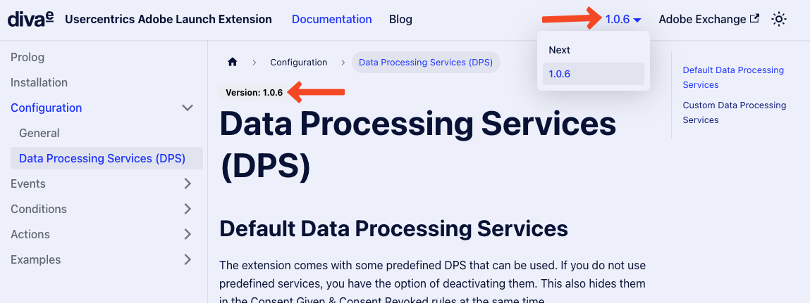
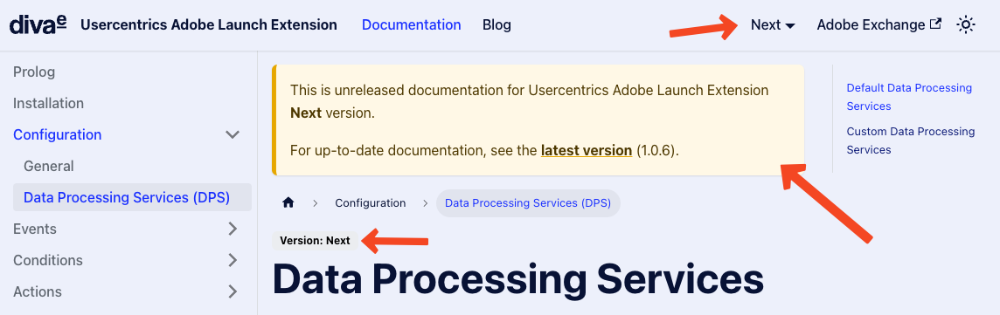

We implemented versioning of our documentation. This means that you can now see the documentation for a specific version 
of the extension.

This is useful if you are using an older version and did not update the extension in Adobe Launch yet.

<!--truncate-->

There is a version dropdown in the navbar:

By default, the current version is displayed. As of writing it is the 1.0.6 which is matching the currently released extension version.

If you have an older version installed, you can choose it there.

The "Next" version is our work in progress state for the next version of the extension and documentation.

You will also see a hint, in case you open the wrong version by mistake:

