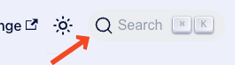
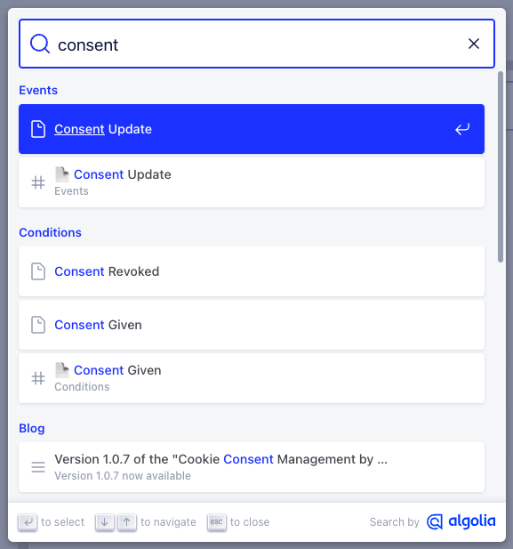

We added a search functionality to our documentation website 🎉 Now you can find the information you are looking for even faster.

The search is available in the navbar on the top right:

<!--truncate-->

You can also open it with a keyboard shortcut: `MAC / STRG` + `K`.

Under the hood we are using [Algolia DocSearch](https://docsearch.algolia.com/). It is a free service for open source projects. You can find more information about it in the [Algolia DocSearch documentation](https://docsearch.algolia.com/docs/what-is-docsearch).

More information about how to integrate it into Docusaurus can be found in the [Docusaurus Search documentation](https://docusaurus.io/docs/search#using-algolia-docsearch).