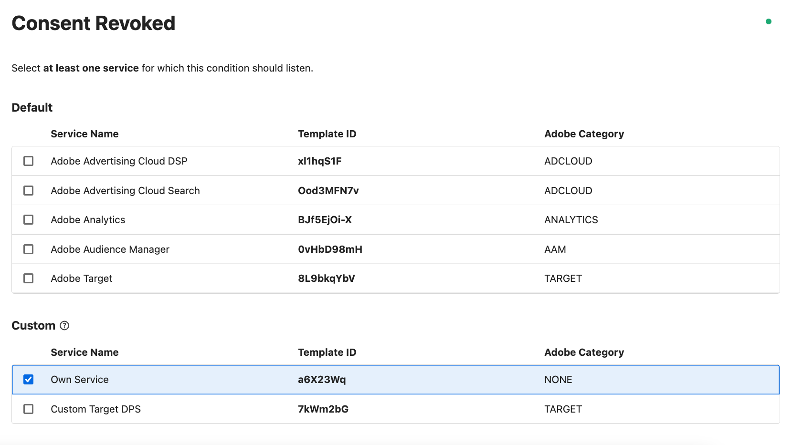

# Consent Revoked

Based on the mappings configured in the extension’s configuration page, the condition evaluates to `true` if at least one of the selected services has changed its consent to "consent revoked".

:::caution Please Note

There is a distinction by which event this condition was triggered.

:::

* **Case 1**: The condition was triggered by the "Usercentrics: Consent Update" event. In this case, the consent must actually change from "Given" to "Revoked" so that the condition evaluates to `true`.
* **Case 2**: The condition is triggered by any other event. If this is the case, it is only checked whether the current consent status is set to "Revoked" so that the condition evaluates to `true`.

