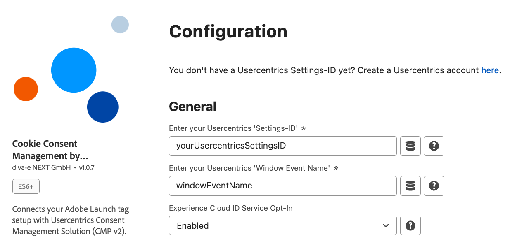

# Configuration

## Required Settings

### Settings-ID

Settings-ID of the relevant Usercentrics account. Can be found in the Usercentrics Admin Interface. This is needed to build the script-tag that will be placed on your website to launch usercentrics.

### Window Event Name

Window Event Name of Usercentrics will be used to identify consent status. You must create a new window event in the Usercentrics Admin Interface under 'Implementation' -> 'Data Layer & Events' -> 'Window Event'. The extension will use it as a “Trigger” for any changes that the end-users make to their consent settings. If you already defined a Window Event Name within Usercentrics, you can also use that one. However, we recommend creating an own Window Event Name, just for the Usercentrics Launch Extension. 

## Optional Settings

### Experience Cloud ID Service Opt-In

This allows you to use the Experience Cloud ID Service Opt-In feature, which handles consent for specific Adobe products. You can find a list of all default supported Adobe products in the Default section of Data Processing Services in the extension’s settings page. Please keep in mind that this will only work if the "Experience Cloud ID Service"-Extension is installed and Opt-In is enabled.

### Predefined Data Processing Service

We already have defined some of the Adobe Products if you plan to use the Experience Cloud ID Service Opt-In. Those are: Adobe Advertising Cloud (DSP, Search), Adobe Analytics, Adobe Audience Manager & Adobe Target.
