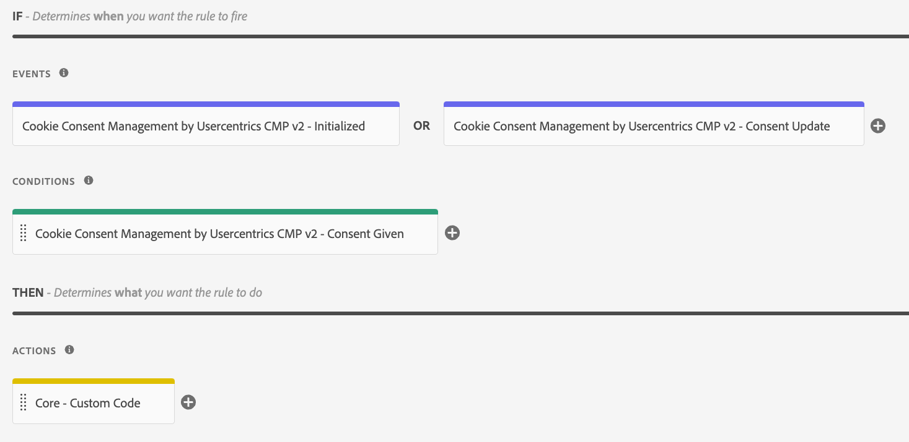

# Consent Update

Triggers when the configured Window Event fires. This update will not be called on the initial Window Event, to prevent the site from looping (e.g., if a page reload is configured as action).

:::tip

If the consent for an initial page view and a new user is already given (for example for technically required DPS), we recommend adding the “Cookie Consent Management by Usercentrics CMP v2 - Initialized” event to the rule.

:::

