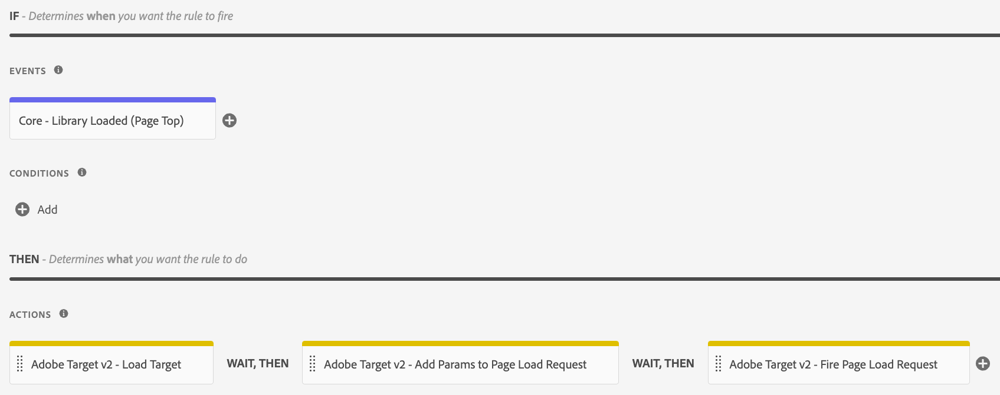

# Loading Adobe Target

## With the ECID-Feature enabled

### Experience Cloud ID Service extension config

### Adobe Target extension config

### Rule for loading Adobe Target

## Without the ECID-Feature enabled

