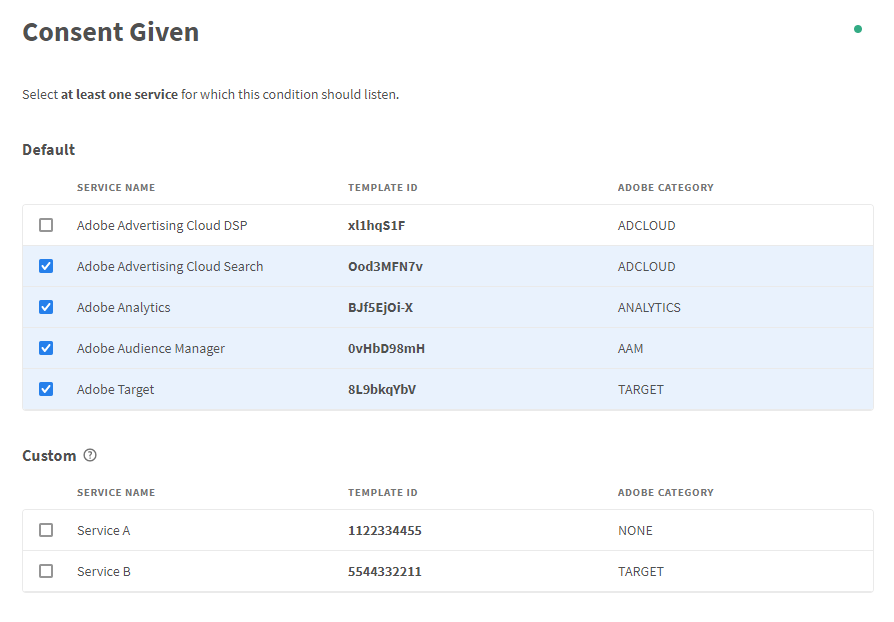

# Consent Given

Based on the mappings configured in the extension’s configuration page, the condition evaluates to `true` if a selected service (multiple services possible) has changed its consent to "consent given".

:::caution Please Note

There is a distinction by which event this condition was triggered.

:::

* **Case 1**: The condition was triggered by the "Usercentrics: Consent Update" event. In this case, the consent must actually change from "Revoked" to "Given" so that the condition fires.
* **Case 2**: The condition is triggered by any other event. If this is the case, it is only checked whether the current consent status is set to "Given" in order to fire the condition.

