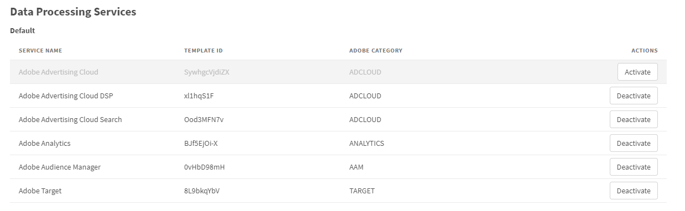
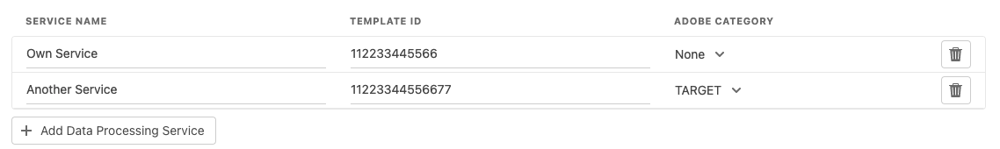

# Data Processing Services (DPS)

## Default Data Processing Services

The extension comes with some predefined DPS that can be used. If you do not use predefined services, you have the option of deactivating them. This also hides them in the Consent Given & Consent Revoked rules at the same time.

## Custom Data Processing Services

If you use a DPS that is not listed in the default section (see above), you can configure them in this section. To clearly identify the DPS, the Template Name and the Template ID from your Usercentrics Admin Interface and (optionally) the information whether it is an Adobe product should be specified. If you have activated the ECID Opt-In, the consent will be applied automatically for the specific Adobe categories.

