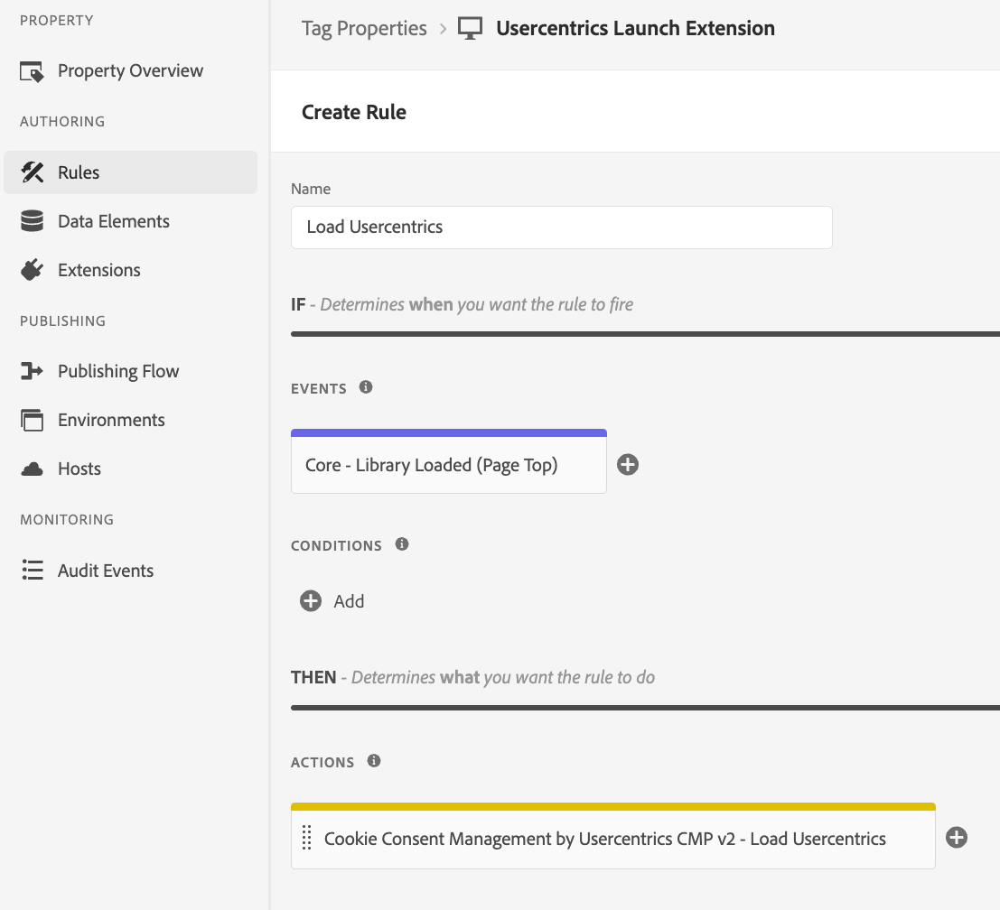

# Load Usercentrics

Loads the Usercentrics (V2) CMP and applies the Usercentrics consents to the ECID Opt-In framework if enabled in the extension’s configuration page.

:::danger Loading order

To ensure that the CMP is loaded first, the order should be set to 1 for the "Library Loaded (Page Top)" event.

:::

