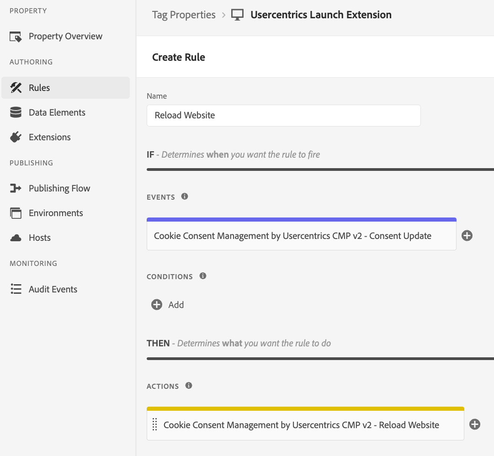

# Reload Website

Simple action to reload the website. This is useful if you use third party tags, which need a reload for reading a new consent state.

:::tip Please note

This is an optional action that is not necessarily required for an implementation of the DPS you are using.

:::

