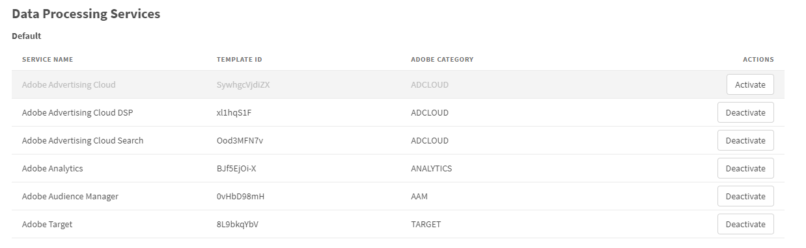

# Data Processing Services (DPS)

## Default Data Processing Services

The extension comes with some predefined DPS that can be used. If you do not use predefined services, you have the option of deactivating them. Deactivation has the following effects:

* Hides them in the Consent Given & Consent Revoked rules.
* When using the ECID Opt-In framework, those will not be evaluated.
* Generally, a deactivated DPS is not evaluated anywhere.

## Custom Data Processing Services

If you use a DPS that is not listed in the default section (see above), you can configure them in this section. To clearly identify the DPS, the Service Name and the Template ID from your Usercentrics Admin Interface and (optionally) the information whether it is an Adobe product should be specified. If you have activated the ECID Opt-In, the consent will be applied automatically for the specific Adobe categories.

The Service Name is not used for evaluating consent, the Template-ID is the important data. The Service Name is only used to assign a human-readable name for the Template-ID inside the extension, e.g. when using it in a Consent Given condition. You may change the name at any point, the evaluations will keep working, since the Template-ID is used internally.

