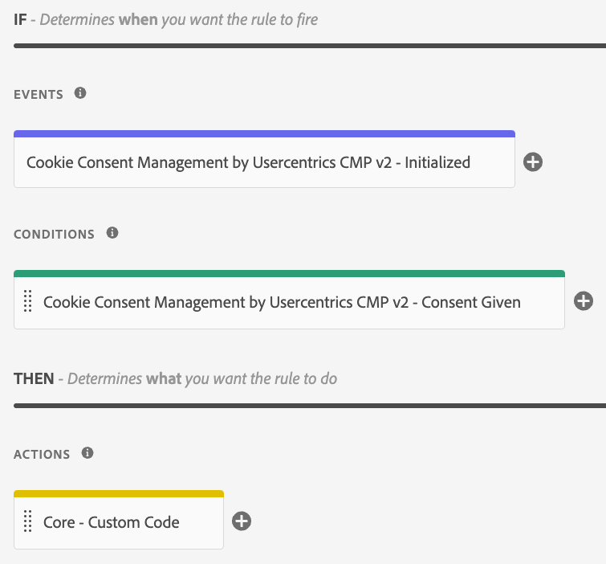

# Initialized

This event will be triggered when the CMP has loaded and can be used **to ensure the CMP is already initialized before performing app interactions.**

:::tip Read More

https://docs.usercentrics.com/#/v2-events?id=app-initialization-browser-ui

:::

